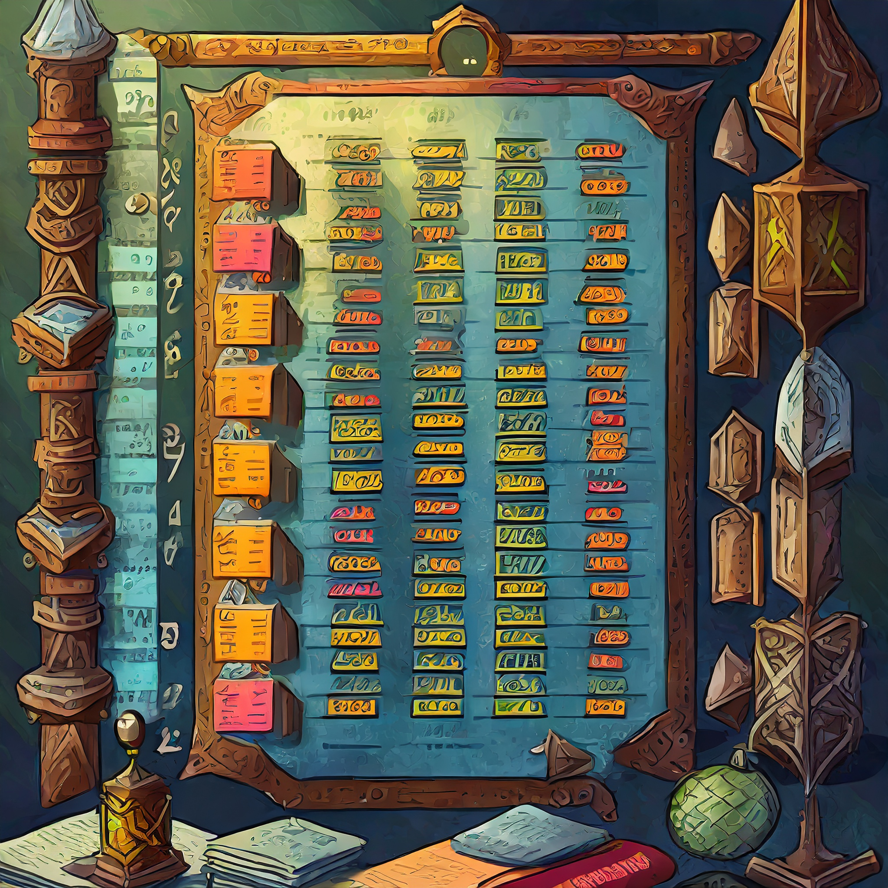

[](https://classroom.github.com/open-in-codespaces?assignment_repo_id=22474104)
# Esercitazione 6 - Le strutture dati in C



In questa esercitazione occorre implementare tutte le funzioni definite nei file `node.h` e `sorted_list.h`.

> Il file `testing.h` è una libreria necessaria per i test, non dovete toccarla.
>
> Questo progetto è compatibile sia con l'IDE CLion che con l'IDE Code::Blocks
>
> Per usare questo progetto offline, naturalmente dovete prima scaricarlo da REPLit
>
> Se usate CLion, aprite il file `Makefile` con Clion (Apri con -> Clion)
>
> Se usate Code::Blocks, aprite il file con estensione `.cbp`

Gli unici files che verranno corretti sono il file `node.h` e il file `sorted_list.h`.

Le funzioni da implementare sono di 5 tipi su 1 entità:

- costruzione di entità (ovvero la creazione di entità a partire da certi parametri)
- clonazione di entità (ovvero la creazione di una nuova entitò a partire da un'altra)
- distruzione di entità (ovvero la deallocazione completa di una entità)
- inserimento ordinato in una lista
- operazioni di routine su liste ordinate (controllo elementi, rimozione, ottenimento dimensione, etc...)

Qui c'è l'elenco completo dei test:

```
createNode(...)
  createNode("0")
  createNode("1")
  createNode("2")
  createNode("3")
  createNode("4")

cloneNode(...)
  cloneNode(NULL)
  cloneNode(temp) - Test 0
  cloneNode(temp) - Test 1
  cloneNode(temp) - Test 2
  cloneNode(temp) - Test 3
  cloneNode(temp) - Test 4

destroyNode(...)
  destroyNode(NULL)
  destroyNode(node)
  destroyNode(node) - de-allocation

createEmptySortedList(...)
  createEmptySortedList()

cloneSortedList(...)
  cloneSortedList(NULL)
  cloneSortedList(empty_list)
  cloneSortedList(list) - Test 0
  cloneSortedList(list) - Test 1
  cloneSortedList(list) - Test 2
  cloneSortedList(list) - Test 3
  cloneSortedList(list) - Test 4

destroySortedList(...)
  destroySortedList(NULL)
  destroySortedList(empty_list)
  destroySortedList(list) - Test 0
  destroySortedList(list) - Test 1
  destroySortedList(list) - Test 2
  destroySortedList(list) - Test 3
  destroySortedList(list) - Test 4

getSortedListSize(...)
  getSortedListSize(NULL)
  getSortedListSize(empty_list)
  getSortedListSize(list) - Test 1
  getSortedListSize(list) - Test 2
  getSortedListSize(list) - Test 3

sortedListContains(...)
  sortedListContains(NULL, "1")
  sortedListContains(empty_list, "1")
  sortedListContains(list, "4") - Test 1
  sortedListContains(list, "2") - Test 1
  sortedListContains(list, "1") - Test 1
  sortedListContains(list, "3") - Test 1
  sortedListContains(list, "4") - Test 2
  sortedListContains(list, "2") - Test 2
  sortedListContains(list, "1") - Test 2
  sortedListContains(list, "3") - Test 2
  sortedListContains(list, "4") - Test 3
  sortedListContains(list, "2") - Test 3
  sortedListContains(list, "1") - Test 3
  sortedListContains(list, "3") - Test 3

insertNode(...)
  insertNodeInSortedList(NULL, "1")
  insertNodeInSortedList - test already sorted
  insertNodeInSortedList - test reverse sorted
  insertNodeInSortedList - test randomly unsorted

printSortedList(...)
  printSortedList(NULL)
  printSortedList(empty_list)
  printSortedList(list)
```

## FAQ

### Non vedo tutti i test, come mai?

I test compariranno man mano che implementate correttamente le funzioni.

### Devo preoccuparmi di deallocare correttamente?

I test controllano anche la memoria allocata, quindi si.

### La lista è ordinata, significa che devo fare algoritmi diversi?

In certi casi occorre ottimizzare (uscire prima dai cicli) per avere il massimo punteggio.

### Posso modificare altri file a parte `node.h` e `sorted_list.h`?

No.